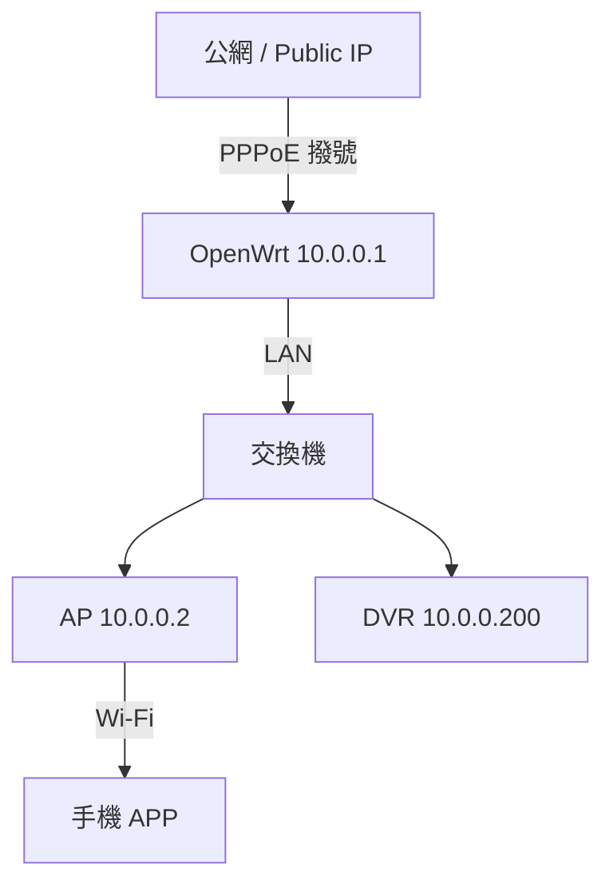

昨天我爸突然跟我說一樓攝影機 APP 斷線了。通常這種情況只要外部 IP 對了、Port 80 有開就能看，但我直覺沒那麼簡單——畢竟我最近才剛動過家裡的 OpenWrt 撥號架構。

這不是單純改密碼的問題，這是一場 **「排除干擾、理清邏輯」** 的除錯之戰。

---

## 0. 現場勘查：混亂的「戰場」

家裡的網路是從 3F 的小烏龜接工控機（OpenWrt）撥號，再透過交換機拉一條長長的線到 1F。

- **1F 現場：** 有一台 D-Link AP 和一台環名（Aquila DVR）主機。
- **初期困境：** 爸爸與安裝朋友通電話，兩邊雞同鴨講。對方一直問有沒有固定 IP，但問題核心根本不在那。

**技術直覺：** 這類傳統 DVR 一定要接螢幕滑鼠才能設定，而且我懷疑 1F 的網段早就跟 3F 斷連了。

---

## 1. 除錯過程：暴力破局與眼尖發現

### 第一階段：搞定螢幕，拿回主導權

我跟我爸說：「交給我來。」搞到螢幕後，我直接進入 DVR 內部。原本想在 DVR 裡更新 PPPoE 密碼，結果「笑死，完全沒反應」。這驗證了我的想法：**別讓 DVR 撥號，讓它乖乖當內網成員就好。**

### 第二階段：關鍵的「眼尖」時刻

我拿筆電接上 1F 的 AP 測試，發現竟然連不上 3F 的網關 `10.0.0.1`。這代表 1F 的 AP 設定完全打架，導致這條線路根本沒通到樓上。

為了排除變數，我採取了最暴力的測試法：

1. **物理繞過：** 把 3F 交換機拉下來的網線，**直接插在 DVR 主機上**，暫時把那台礙事的 AP 拿走。
2. **寫死靜態 IP：** 我把 DVR 改為 LAN 模式，手動設定 IP 為 `10.0.0.200`，網關指向 `10.0.0.1`。
3. **驗證成功：** 跑回 3F 電腦前，顫抖著輸入 `10.0.0.200`……畫面跳出來了！網頁端成功登入！

---

## 2. 最終架構：AP 的重生與 Port Forwarding

既然主機通了，剩下的就是把 1F 的網路架構理順，並把畫面送回爸爸的手機：

1. **AP 去功能化：** 重置那台 D-Link AP，進後台改網段、**關閉 DHCP**，並把接口改插在 **LAN** 上（別插 WAN）。它現在就是一台完美的「無線交換機」。
2. **開門 (Port Forwarding)：** 在 3F OpenWrt 後台，將外部的 Port 80 映射到內網的 `10.0.0.200`。

---

## 3. 完工清單：我的網段地圖

---

## 4. small R 的技術筆記

- **別聽「雞同鴨講」：** 在 Debug 時，別人提供的錯誤資訊會干擾判斷。信任你的筆電和 Ping 測試。
- **縮小打擊面：** 當網路怪怪的，就把 AP 拔掉，直接對接主機。先確認「線有通」，再回頭去修 AP 的設定。
- **眼尖是標配：** 能第一時間發現 `10.0.0.1` 無法訪問，幫我省下了好幾個小時瞎猜的時間。

---

## 未來展望：朝向更安全的「隱身」網路

雖然目前順利解決了，但這只是第一步。未來我有兩個優化目標：

1. **導入 Tailscale (VPN)：** 目前的 Port Forwarding 雖然方便，但把 Port 80 暴露在公網其實有安全隱憂。我計畫在 OpenWrt 上加裝 Tailscale，讓我人在外面也能像在內網一樣直接跳回家。
2. **安全性與便利性兼顧：** 關閉對外的埠口轉發，讓家庭成員只需要動動手指開啟 VPN 就能訪問設備，這才是我追求的「既安全又無感」的 HomeLab 體驗。

**Done.** 雖然跑上跑下累得半死，但看著手機畫面重新跳出來的那一刻，這種把混亂理順的成就感，就是我最爽的時刻！

---

*持續更新中... 下一篇預計紀錄 [Tailscale 的部署實戰](/blog/first-time-to-building-tailscale)！*
