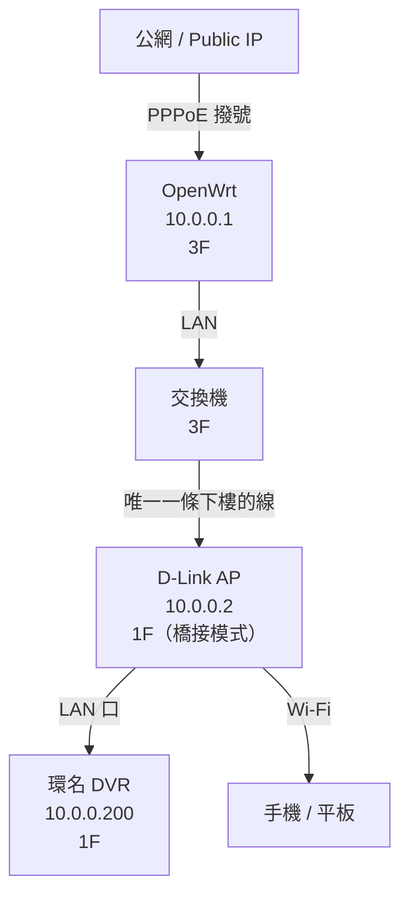

距離上次修好監視器斷訊、又部署好 Tailscale，已經過了快兩個月了。

今天打開 LuCI 後台，看到 OpenWrt 上線時間顯示 **45 天 5 小時**，感覺可以寫一篇「後記」了。

---

## 先更正一個細節：拓樸圖不完全準確

上一篇文章的網段地圖畫成這樣：

```
OpenWrt → 交換機 → AP
                 → DVR
```

但這不是實際的接法。**DVR 不是直接插在交換機上，而是插在 AP 底下。**

### 為什麼這樣設計？

原因很簡單：**樓上到樓下只拉了一條實體網路線。**

從 3F 到 1F 拉線很麻煩，當初只走了一條線。問題是 1F 有兩個需求：

1. DVR 主機需要有線連線（穩定、不掉封包）
2. 家人需要 Wi-Fi（手機、平板）

解法：讓 **AP 同時扮演兩個角色**——

- 把那條從 3F 來的線插進 AP 的 WAN/LAN 口
- DVR 再從 AP 的其中一個 LAN 口接出去
- AP 本身繼續廣播 Wi-Fi

因為 AP 已經設定成純橋接模式（DHCP 關閉、插 LAN 口），所有設備都還是拿 3F OpenWrt 分配的 IP，在同一個 `10.0.0.0/24` 網段內。

### 實際拓樸



這個設計的好處是：不需要再拉第二條線，AP 就是那根線的「分叉器」。

---

## 45 天的運行狀態

```
主機名稱：OpenWrt
裝置型號：AMD Corporation Pumori CRB
架構：AMD R-260H APU with Radeon HD Graphics
韌體版本：OpenWrt 23.05.3 r23809-234f1a2efa
核心版本：5.15.150
上線時間：45d 5h 35m 3s
平均負載：0.00, 0.00, 0.00
```

負載 `0.00` 不是沒在工作，是工控機跑這點流量根本不喘。這台機器的前生是某個企業退役的迷你 PC，換個用途之後反而發揮了它的價值。

45 天中間沒有手動重啟過，停電的話 UPS 有頂著，算是真正「裝上去忘記它」的狀態。

---

## 目前還開著的功能

- **Port Forwarding（Port 80 → DVR）**：讓爸爸在外面可以直接用手機 APP 看監視器
- **Tailscale（Subnet Router）**：我在外面需要進內網時走 VPN，不暴露額外的埠口
- **Exit Node（尚未常態開啟）**：偶爾用一下，流量出口走家裡的線

這兩個功能其實有點矛盾——Port Forwarding 是「把門打開給外面的人」，Tailscale 是「自己偷偷爬牆進去」。理想情況是只留 Tailscale，但 DVR 的 APP 還沒確認能透過 Tailscale 正常走，所以 Port 80 先開著。

---

## 下一步要做的事

1. **測試 DVR APP 能否透過 Tailscale 連線**：如果可以，就關掉 Port 80 的 Forwarding，減少暴露面
2. **DVR 搬 IP 或換網段**：現在 DVR 直接在主網段，有點不乾淨，考慮之後隔一個 VLAN
3. **監控告警**：上線 45 天都靠眼睛看，應該設個簡單的 uptime 監控，斷線能收到通知

暫時這樣。穩定就是勝利。

---

*相關文章：*
- [*監視器斷訊，根源是網段衝突*](/blog/fixing-home-surveillance-network-glitch)
- [*Tailscale on OpenWrt：從踩坑到跑通*](/blog/first-time-to-building-tailscale)
