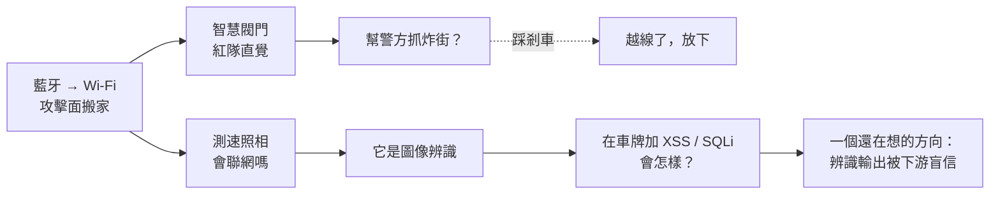

這篇不是教學，也不是什麼發現，甚至還不是一個決定。就是把最近腦子裡繞的一圈想法記下來——它最後停在一個我覺得有東西、但還在想的問題上，而繞過去的那些岔路，比問題本身有意思。

---

## 起點：藍牙變成 Wi-Fi

我最近一直在想一件小事：現在很多設備，不再用藍牙了，改成連 Wi-Fi。

從使用者的角度這只是「更方便」——手機不用靠近就能控制。但從資安的角度，這是攻擊面的整個搬家。藍牙的前提是物理距離，你得站在旁邊；一旦改成 Wi-Fi、甚至接上雲端，這台設備就從「近場」變成了「任何能連到它的人」。方便和暴露，其實是同一件事的兩面。

這個念頭一旦起來，看什麼東西都會忍不住多想一層。

---

## 一個很酷、然後我開始亂想的東西

我看到有人展示智慧電子閥門，可以用手機控制。第一反應是覺得很酷，第二反應就變成：如果我是紅隊，我可以拿它幹嘛？

這是一個我很難關掉的習慣——看到一個能被遠端控制的東西，就會自動去想它的信任邊界在哪裡、誰能對它下指令、下錯指令會怎樣。

那個閥門是裝在排氣管上的，用途是降低分貝，白話講就是為了炸街時不那麼容易被檢舉、被拍照。於是我又往下想了一步：如果有辦法從外部去影響這種閥門，是不是能做成一個工具，幫警方抓這類違規？當下我甚至覺得這是個商機。

---

## 然後我踩了剎車

但這個念頭沒走多遠就卡住了，卡在一個很簡單的地方：

> 如果我做得出「幫警察控制別人排氣閥門」的能力，那我同時也就具備了「控制別人排氣閥門」的能力。

這兩件事是同一個技術，差別只在我把它指向誰。而且更根本的問題是——去介入一台不屬於我的設備，本身就已經越過線了，不管我心裡想的是抓壞人還是什麼。動機不會改變那個動作的性質。

好笑的是，我對現行的交通制度一堆意見、一肚子火——結果腦子裡第一個冒出來的，居然是怎麼「幫忙抓違規」。我大概比自己以為的還矛盾。

所以這條我放下了。留下來的不是那個點子，是那個「等一下，這樣不對」的瞬間。我覺得能認出自己什麼時候該停，比想得出多少攻擊點更重要。

---

## 換一個方向：測速照相

放掉閥門之後，我的好奇轉到另一個天天在路上看到、而且是「官方的」東西：測速照相。

我第一個想問的是：那種測速照相，會聯網嗎？如果會，它就不只是一台相機，而是一個節點。這個我還不知道答案，得查。

第二個問題是規格從哪裡來。這種設備通常是政府標案採購的，而招標文件裡往往會寫技術規格——政府採購的資訊是公開的。也就是說，很多「這東西到底怎麼運作」的線索，其實攤在陽光底下，只是沒人特地去看。這一點本身就滿有意思：公開，不等於有人真的去讀。

---

## 真正讓我停下來的那個問題

想到測速照相是靠影像辨識運作的，我腦子裡冒出一個問題，前面那些亂想突然都指向了同一個地方：

> 它是圖像辨識對吧。那如果我在自己的車牌附近，加上一段 XSS 或 SQL injection 的字串，會怎樣？

車牌上的字，是被辨識系統「讀」進去的。而後端程式很可能把辨識出來的那串字，當成自己算出來的、可信的內部資料，直接拿去查資料庫、直接顯示在後台頁面上。可是那串字是誰決定的？是車主決定的。中間隔了一層辨識模型，那層模型讓原本該有的警覺心鬆懈了——表單輸入大家都知道要過濾，但攝影機讀出來的字，常常沒人當它是「外部輸入」。

這就不是亂想了，這感覺是一個可以驗證的問題。

---

## 一個還在想的方向

如果真的要做，它大概會長成這樣：**做車牌辨識，然後用資安的角度去探討它。** 能不能在車牌（或任何被辨識的媒介）上放進攻擊字串，這段字串經過辨識層之後還剩多少能用，最後會對後端造成什麼隱患。

我還沒決定這會不會變成我的專題，也可能想一想就發現有什麼根本的坑、或者早就有人做過了。現在它就是一個候選方向，我還在掂量。但有一點是確定的：真的要做的話，我不會去碰任何真實的測速系統——那是紅線。整件事只會在我自己的電腦上、封閉環境裡跑：自己生成印著 payload 的圖、自己的辨識管線、自己的脆弱版後端，量的是「辨識這一層到底擋掉了多少攻擊」。測速照相和排氣閥門，從頭到尾只是動機，不是對象。

回頭看，這一路從「設備改用 Wi-Fi」亂想到一個還沒定案的問題，中間繞過一個我主動放棄的點子。我留這篇下來，是因為過程裡最真實的東西不是終點——它根本還沒到終點——而是那些岔路，包括那條我走了一半、發現不該走、然後退回來的路。
