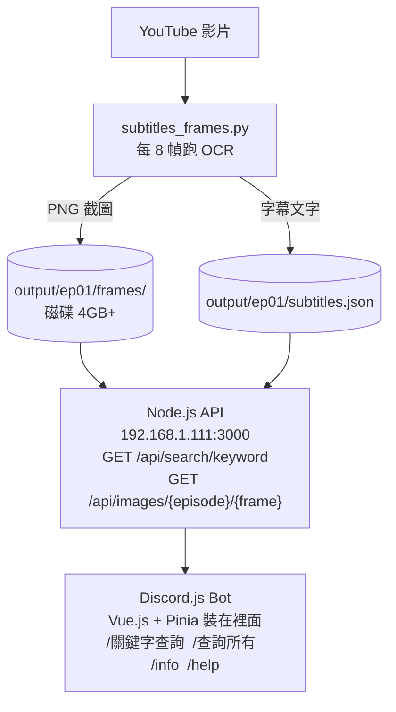
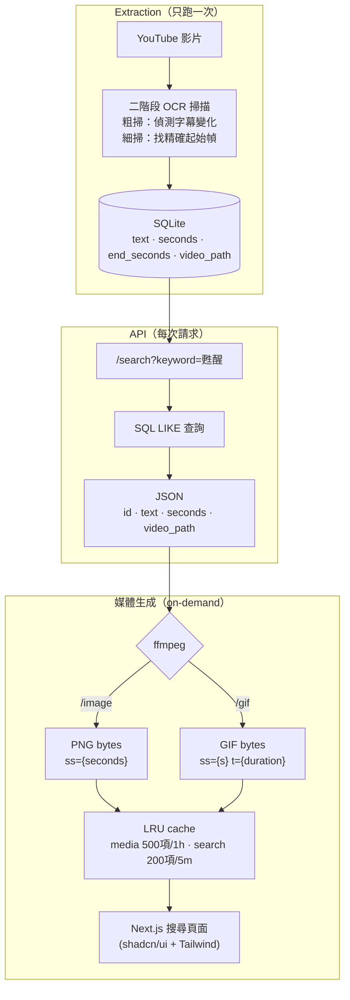

## 起點：我只是想讓 Discord Bot 回傳截圖

這個專案的起源很單純：我想在 Discord 上搜尋 Ave Mujica 動畫的字幕截圖。
輸入一句台詞，bot 回傳那個畫面。就這樣。

當時沒什麼全端經驗，但想累積，所以就硬做了。結果誤打誤撞做出三個獨立的專案：

```
AveMujicaBot/
├── ave-mujica-subtitle-extractor/   # Python
├── ave-mujica-api/                  # Node.js + Express
└── Ave-Mujica-Bot/                  # Discord.js
```

### 舊版架構是這樣運作的



**Extractor**：下載 YouTube 影片，每 8 幀跑一次 OCR，截圖存成 PNG，字幕存成 JSON。

**API**：讀 JSON 檔案，做模糊搜尋，serve PNG 圖片。IP 寫死 `192.168.1.111:3000`。

**Bot**：呼叫 API，把結果送進 Discord。裡面裝了 Vue.js 和 Pinia。
（對，一個 Discord bot 裡有前端框架，因為我當時覺得狀態管理需要 Pinia。）

### 實際長什麼樣

`subtitles.json` 每一筆長這樣：

```json
{
  "text": "下次武道館演出時",
  "frame": 7032,
  "seconds": 293.0,
  "timestamp": "00:04:53",
  "image_path": "frames/ep01_frame_007032.png",
  "confidence": 0.89,
  "episode": 1
}
```

Bot 指令只有四個：`/關鍵字查詢`、`/查詢所有`、`/info`、`/help`。搜尋結果有分頁，可以跳頁。

三個專案各自有 `package.json` 或 `requirements.txt`（extractor 連 requirements.txt 都沒有），部署要手動開三個 terminal，IP 換了就整個壞掉。

這不是架構，這是意外的產物。

---

## 舊版的思路：不知道有別的方法

「要顯示截圖」→「那就把截圖存起來」。這是我當時唯一想得到的方法，不是因為這樣最好，而是因為我不知道有別的方法。

更誇張的是，那時候在 **Windows** 上開發。Python + EasyOCR + ffmpeg 在 Windows 上是地獄難度。我也不知道當時怎麼撐過的。

上線之後，用起來感覺怪怪的，很不方便。但我當時能想到的解法只有一個：

> **搬上雲端。** 把圖片存 S3，API 搬 EC2，這樣應該就好了吧？

還好我沒有真的去實作。

---

## 某天打開資料夾，看了五秒，關掉

決定重寫。不是因為要加功能，而是「我看不下去了」。

重寫目標很簡單：
1. 不要三個獨立專案
2. 一個指令能啟動
3. 參數不要 hardcode

但架構怎麼設計，還沒想清楚。

---

## 架構決定 1：為什麼要存圖片？

重寫時，第一個計畫還是把 PNG 存進 Supabase Storage。畢竟舊版就是這樣做的。

然後我開始估算儲存需求：

| 項目 | 估算 |
|---|---|
| 每集字幕數 | ~400 筆 |
| 13 集總計 | ~5,200 筆 |
| 每張 PNG（1080p） | ~800 KB |
| **總儲存需求** | **~4 GB** |

Supabase 免費方案是 1 GB。改 JPEG 壓到 200 KB，5,200 張 = 1 GB，壓線，不舒服。

然後我問自己一個問題：**我為什麼要存圖片？**

因為 API 要回傳截圖給 bot。截圖從哪裡來？從影片的某一幀。影片我已經有了，放在 `videos/` 裡，13 集加起來約 1.3 GB。

<Columns>
<Card>

**舊版**

影片 → 提前截圖 → 全部存起來 → API 回傳存好的圖

</Card>
<Card>

**新版**

影片 → API 接到請求時再截

影片本來就在，為什麼要多存一份？

</Card>
</Columns>

```python
# 用 ffmpeg 直接從影片截一幀，不需要預存 PNG
ffmpeg.input(video_path, ss=seconds).output("pipe:", vframes=1, vcodec="png")
```

這一個念頭砍掉了整個圖片儲存層。

---

## 架構決定 2：GIF 也一樣

加 GIF 功能的時候，我的第一反應還是老思路：
「那我要把每個字幕從開始到結束的所有幀都存下來？」

算一下：3 秒片段 × 10fps = 30 幀，5,200 筆 × 30 張 × 1 MB = <MetricChip>156 GB</MetricChip>。不行。

退一步想：GIF 是什麼？是一段影片片段的重複播放。我需要的東西全都已經有了：

- 影片檔案（已經有了）
- 開始時間（OCR 掃出來的）
- 結束時間（下一句字幕出現的時間）

不需要預先把 GIF 生成並存起來。

```python
# 需要 GIF 的時候，直接從影片切
ffmpeg.input(video_path, ss=start_seconds, t=duration)
    .filter("fps", 10)
    .filter("scale", 640, -1)
    .output("pipe:", format="gif")
```

所以資料庫裡只需要：**文字 + 開始時間 + 結束時間 + 影片路徑**。

```sql
CREATE TABLE subtitles (
    id          TEXT PRIMARY KEY,
    episode_id  TEXT,
    timestamp   TEXT,       -- "00:01:23"
    seconds     REAL,       -- 83.0
    end_seconds REAL,       -- 86.4
    text        TEXT,
    video_path  TEXT,       -- "videos/ep01.mp4"
    confidence  REAL
);
```

---

## 架構決定 3：SQLite 先頂著，Supabase 之後再說

設定 Supabase 需要時間，我不想現在花在這上面。

這時候我問了 Agent，它告訴我一個我不知道的選項：**SQLite 可以先頂著用，schema 跟之後的 Supabase 幾乎一樣，切換只是改一個 flag**。

這是一個我當時不知道存在的選項。知道之後是顯而易見的決定。

```bash
# 現在，本地 SQLite
python -m extractor.cli process-all --backend sqlite

# 之後，改一個 flag
python -m extractor.cli process-all --backend supabase
```

這個決定讓我把整個 extraction 當天就跑起來，而不是卡在 Supabase 環境設定。

---

## 轉折點：盯著 DB 看的那一刻

真正讓我確定「只存時間軸」這個念頭的，是跑 OCR 的時候盯著輸出的資料看：

```
episode_id | timestamp | text              | seconds | end_seconds
01         | 00:00:21  | 來吧,甦醒之夜到來了 | 21.0    | 24.0
01         | 00:00:24  | 需不需要我把她叫醒? | 24.0    | 26.4
```

就這樣。**這幾個欄位就是全部了。**

截圖和 GIF 用這幾個數字就能現場生成，不需要預存任何媒體檔案。

---

## Agent 在這個過程中的角色

全程都有 AI Agent 參與，但我想說清楚它做了什麼、沒做什麼。

<Columns>
<Card>

**我做的**

- 「只存時間軸」的念頭（盯著 DB 自己想到的）
- 架構方向的判斷（存不存圖、GIF 怎麼做）
- 要不要繼續做、怎麼做的決定

</Card>
<Card>

**Agent 做的**

- 填補知識盲區（SQLite 可以當過渡方案）
- 驗證方向（有沒有我沒想到的？）
- 加速實作（想法當天就能跑）

</Card>
</Columns>

這幾個專案下來，我對 AI 工具的使用方式是：**大方向是我的，Agent 負責驗證、實作、補盲區**。

前提是你得先有判斷力，知道方向對不對。這個判斷力，是從舊版那三個爛攤子裡長出來的。

---

## 新版架構



不預存任何媒體。不需要 S3 或 Supabase Storage。影片留著，需要什麼讓 ffmpeg 現場生成。

---

## 心態轉變的核心

舊版的邏輯：**盡量預先存好所有東西，之後才快。**

新版的邏輯：**只存最小的原始資料，其他的需要時再算。**

兩者的差別不是技術能力，而是對「成本」的定義不同。

舊版把「運算成本」當作最貴的東西，所以盡量預算；
新版發現「儲存成本」和「複雜度成本」其實更貴——你要一直維護它、備份它、遷移它、出錯了要除錯它。

ffmpeg 生成一張截圖需要 <MetricChip>50ms</MetricChip>。
但維護一個 <MetricChip>4 GB</MetricChip> 的圖片資料夾帶來的同步問題、版本問題、備份問題，代價遠不止 50ms。

還好我沒有把「搬雲端」那個版本做出來。

---

## 做完了

<TaskList tasks='[
  {"title":"API 層（SQLite → HTTP endpoints + ffmpeg on-demand）","completed":true},
  {"title":"Web UI 取代 Discord Bot（Next.js + shadcn/ui）","completed":true},
  {"title":"GIF / 搜尋結果 LRU cache","completed":true},
  {"title":"Supabase 遷移","completed":false}
]' />

架構想清楚了，code 也寫完了。

---

## 現在的樣子

Discord Bot 最後沒有重寫——整個換掉了。

與其繼續維護一個 Bot，不如做一個網頁。搜尋、截圖、GIF，瀏覽器就能跑，不需要 Discord 帳號，不需要把 Bot 請進伺服器。

最後長出來的是 **雞狗查圖**——一個用 Next.js 寫的字幕截圖搜尋網站。

技術棧最後定在這裡：

- **Extractor**：Python、EasyOCR、yt-dlp、SQLite
- **Web**：Next.js、better-sqlite3、ffmpeg、LRU cache、shadcn/ui

另一個意外決定：DB 直接進版本控管。Clone 完就能搜尋，不需要先跑 OCR。影片準備好才有截圖和 GIF——邊界很清楚。

還有一個原本沒有計畫的功能：多系列支援。Ave Mujica 之外，現在也可以加 MyGO!!!!!。Schema 設計的時候沒特別為這個設計，但因為資料夾結構和 DB 都是按系列隔離的，加新系列只是加一個資料夾。

Supabase 遷移最後沒做。SQLite 放在 repo 裡的方案，目前夠用。

還沒上線。但架構清楚了，code 也跑起來了。
