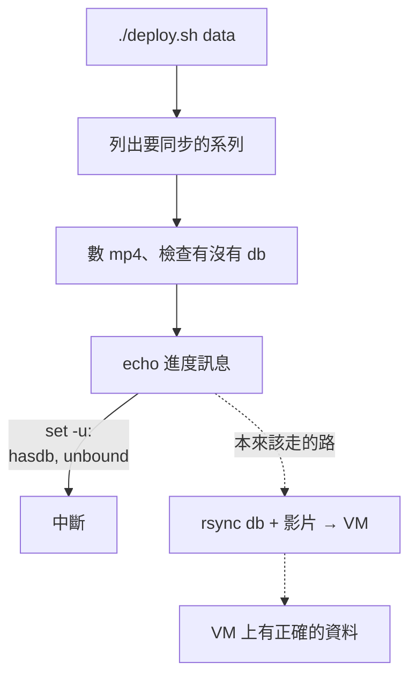

## 症狀：兩個系列的圖全掛

[一句一幀](https://girls-band-shot.alaner652.com) 上線之後陸續加了兩個系列。某天打開網站，搜尋 MyGO!!!!! 和 YUME∞MITA，畫面上一張圖都出不來，Ave Mujica 卻完全正常。

第一直覺是「查詢壞了」。但實際打 API 才發現不是——`/api/search` 回的是 200，資料好好的在裡面。掛掉的是結果卡片上的每一張 `/api/image/...`，全部 500。

搜尋是成功的，是圖片產不出來。這兩件事在畫面上長得一模一樣，這件事本身後面會再回來咬我一次。

---

## 先證明不是程式碼的問題

在本機起 dev server，三個系列各打一次：

| 系列 | `/api/search` | `/api/image` |
|---|---|---|
| ave-mujica | 200 | 200（144 KB JPEG） |
| mygo | 200 | 200（105 KB JPEG） |
| yumemita | 200 | 200（155 KB JPEG） |

三個 SQLite 的 `PRAGMA integrity_check` 全過、schema 完全一致，專案裡本來就有的 `check-media.mjs` 也顯示每一筆 `video_path` 都對得到實際檔案。

本機全綠，線上兩個系列全紅。程式碼和本機資料都可以排除，問題在伺服器上的**狀態**。

偏偏這時候 SSH 連不進去。於是只好換個方向：不看伺服器現在長怎樣，改看**東西是怎麼送上去的**。

---

## 第一個洞：一行 echo 吃掉了整條資料通道

這個專案的部署分兩條通道，是我自己刻意分的：

- **code**：程式碼和 `meta.json` 走 git —— push、遠端 pull、重建容器
- **data**：`subtitles.db` 和影片走 rsync —— 這些是生成資料，不該進 repo

`./deploy.sh data` 就是 data 通道。它的迴圈長這樣：

```bash
local hasdb="無 db"; [ -f "$src/subtitles.db" ] && hasdb="含 db"
echo -e "  → ${BOLD}$s${NC}（$hasdb，$count 個 mp4）"
remote "mkdir -p web/data/$s"
rsync -avz --progress --partial ...
```

問題在中間那行 `echo`。

macOS 內建的 `/bin/bash` 是 **3.2.57**（2007 年的版本，因為授權問題 Apple 一直沒更新）。在 `zh_TW.UTF-8` 底下，它會把 `（`、`：`、`，` 這些全形標點的位元組當成合法的識別字字元。所以 `$hasdb，` 不是「變數 `hasdb` 後面接一個逗號」，而是被解析成一個叫 `hasdb，` 的變數——那當然是不存在的。

腳本開頭有 `set -uo pipefail`。`set -u` 遇到未定義變數就是致命錯誤，非互動 shell 直接結束。

最小重現：

```console
$ /bin/bash -c 'set -u; V=hello; echo "連不上 $V（測試）"'
/bin/bash: V?: unbound variable

$ /bin/bash -c 'set -u; V=hello; echo "連不上 ${V}（測試）"'
連不上 hello（測試）
```

差別只有一組大括號。

### 為什麼這個洞特別壞

同樣的寫法在腳本裡一共有四處，但只有這一處是致命的，因為另外三處都在錯誤訊息或警告訊息裡——那些路徑平常根本不會走到。

這一處在迴圈的主線上，而且在 `rsync` **之前**：



它只是要印一行進度訊息。功能上完全無關緊要的一行，卡在所有真正有用的事情前面。

更糟的是它**不出聲**。`set -u` 的錯誤訊息會出現，但它混在部署腳本一堆彩色的進度輸出裡，而且腳本結束得很乾脆，看起來就像正常跑完了。我從 7 月底寫下這段之後，每次「部署資料」其實一個 byte 都沒送出去，而我一直以為送出去了。

> 一個會噴錯的失敗，你會修。一個安靜結束的失敗，你會相信它成功了。

---

## 第二個洞：一個檔案，兩個來源

挖到這裡順手發現另一件事。

7 月的時候我做過一次整理，commit message 寫的是「把 `subtitles.db` 移出 git，改走 rsync」。但那個 commit 只加了一行 `.gitignore`——

**`.gitignore` 對已經被追蹤的檔案是無效的。**

所以那三個 `subtitles.db` 從頭到尾都還在 git 裡（後來甚至還不小心 commit 進去一個 815 KB 的 `.bak` 備份檔）。同一個檔案同時被兩條通道管：

- git 認為它是版本控管的內容，`pull` 的時候要更新它
- rsync 每次部署都直接覆寫它

於是伺服器上這些檔案在 git 眼中永遠是「已修改的已追蹤檔案」。而 `deploy.sh` 的 code 通道是這樣寫的：

```bash
git fetch origin && git checkout $branch && git pull && docker compose up -d --build
```

`git pull` 一遇到「你的本地修改會被覆蓋」就會拒絕，`&&` 鏈當場斷掉，後面的 `docker compose up --build` 根本不會執行。所以**兩條通道其實都是壞的**，只是壞的原因不一樣。

修法是把 `git rm --cached` 補上——也就是把七月那個 commit 真正做完。

<Card>

**遷移期有個反直覺的陷阱**：檔案 untrack 之後，在伺服器上跑 `git checkout -- web/data` 會把 rsync 上去的 db **丟掉**、還原成 git 版本；接著 `git pull` 又會把它們**刪掉**（因為已經不在 tree 裡了）。結果就是伺服器上一個 db 都不剩，網站直接查不到任何系列。安全的做法是先備份再拉，然後用 data 通道補回去。

</Card>

---

## 第三個洞：一條舊路徑

第三件事是資料本身。MyGO 那個 db 是比較早期的 extractor 產的，裡面的 `video_path` 長這樣：

```
../web/data/mygo/videos/ep01.mp4     ← 舊的
videos/ep01.mp4                       ← 現在的格式
```

API 解析路徑是用 `path.resolve(DATA_BASE, series, videoPath)`，舊格式會指到一個完全不存在的位置，所以那個系列每一張圖都必然 500。

這個我早就發現、也重建修好了。但因為第一個洞，修好的 db 一直躺在我自己的電腦上。

---

## 三個洞疊起來長什麼樣

拆開來看，兩個系列壞的原因其實不一樣：

| | db 在伺服器上？ | 影片在伺服器上？ | 為什麼 500 |
|---|---|---|---|
| **MyGO** | 在，但是 git 裡那份舊的 | 在 | `video_path` 指向不存在的路徑 |
| **YUME∞MITA** | 在，而且完全正常 | 沒有 | 4 支影片、301 MB 從沒送上去 |

我一開始的假設是「db 沒部署好」。對 MyGO 半對，對 YUME∞MITA 完全不對——它的 db 一直是好的，缺的是影片。

真正的共同點不是 db，是那條**整整一個月沒有動過的 data 通道**。

---

## 我判斷錯的那一段

中間有一度我認定是「部署之後前端被退回舊版了」。

現在回頭看，這個假設從一開始就有反證：分支是 `main` 的嚴格後代，checkout 不可能讓程式碼倒退。我那時候沒去驗這件事，是因為畫面上的現象太像「版本不對」——該有的東西沒有出現。

實際上前端一直是對的版本，只是它沒有資料可以顯示，而它顯示「沒有資料」的方式，跟顯示「舊版本」的方式看起來一樣。

<MetricChip>症狀相似</MetricChip> 不等於 <MetricChip>成因相同</MetricChip>。我在這上面多花的時間，全部都是自己加的。

---

## 最值得講的部分：前端為什麼幫不上忙

整件事查了這麼久，最刺的一點是：**後端其實把話說得很清楚。**

上線後我加過一層錯誤處理，圖片產不出來的時候會 log 出實際解析到的路徑、以及可能的原因：

```ts
throw new MediaError(
  "video not found",
  `series=${series} video_path=${videoPath} → ${resolved}（...）`
);
```

這段訊息完整、精準、直指問題。而它從來沒有離開過伺服器的 log。前端一個字都沒有往外傳。

回頭看前端，有三個地方都沒寫錯誤處理，而且每一個都會把「壞掉」偽裝成別的東西：

**圖片 500 時，畫面永遠停在骨架。** `` 只寫了 `onLoad`，沒有 `onError`。圖掛掉 → `imgLoaded` 永遠是 `false` → skeleton 永遠不消失。更慘的是 hover overlay 也被同一個 flag 擋著，所以連台詞和時間戳都不顯示——明明搜尋已經成功，台詞就在手上，卻因為圖片產不出來而一起被藏起來。使用者看到的是一整片永遠在閃的灰塊。

**搜尋 API 失敗會被講成「查無資料」。**

```ts
const res = await fetch(`/api/search?${params}`);
const data = await res.json();      // 沒有檢查 res.ok
setResults(data.results ?? []);     // 400 / 500 → 空陣列
```

沒檢查 `res.ok`、沒有 try/catch。伺服器回 400 或 500，畫面上顯示的是「找不到結果，試試不同的關鍵字」——把系統錯誤翻譯成了使用者的問題。而且沒有 `finally`，萬一回的不是 JSON（例如反向代理吐了一頁 HTML 錯誤頁），`res.json()` 會 throw，載入狀態就再也解不開。

**系列清單 API 掛掉會整頁空白。** 那個 fetch 也沒有 `.catch()`。它失敗 → 系列清單是空的 → 後續的查詢直接 early return → 三個畫面狀態（載入中／沒結果／有結果）一個都不成立 → 純白。

三個地方的共同點是：**錯誤在某一層被吞掉，然後用一個看起來正常的狀態繼續往下走。** 這跟那個 `echo` 是同一種病，只是換了一個語言。

---

## 學到的三件事

**一、失敗必須出聲。** 這是最貴的一課。`set -u` 和 `set -e` 是好東西，它們讓腳本在出錯時停下來——但「停下來」和「讓人知道它停了」是兩回事。一個在成堆彩色進度訊息中間安靜結束的腳本，比一個大聲爆炸的腳本危險得多。

**二、一個檔案只能有一個來源。** git 和 rsync 各自都沒問題，問題是我讓它們管同一個檔案。生成的資料走 rsync，版本控管的資料走 git，界線要畫死。半途而廢的搬遷（改了 `.gitignore` 卻沒 `git rm --cached`）比完全不搬還糟，因為它會讓你以為已經搬完了。

**三、錯誤訊息要一路傳到看得見的地方。** 後端把診斷資訊寫得再好，只要前端不接、不顯示，它就等於不存在。使用者（包括我自己）不會去看 container log，他們只看得到畫面。

還有一件比較難講的：這三個洞單獨看都不難修，難的是它們疊在一起的時候，症狀會互相掩護。MyGO 是路徑錯、YUME∞MITA 是檔案沒上去，但畫面上長得一模一樣，於是我很自然地去找一個能同時解釋兩者的原因——結果找錯了方向。

<Card>

**這篇裡有一段我沒有直接驗證過**：整段追查我始終沒能 SSH 進伺服器，所以「data 通道從沒跑過」是從腳本行為和本機證據推出來的，不是在伺服器上看到的。最後的確認方式很土——把資料真的同步上去，圖片就正常了。這足以證明結論是對的，但不算是完整的現場驗證。

</Card>

---

## 還沒做完的

腳本的修法很無聊：變數後面只要接中文或全形標點，一律寫成 `${VAR}`。順手加了一條掃描指令進 checklist：

```bash
grep -nP '\$[A-Za-z_][A-Za-z0-9_]*[^\x00-\x7F]' *.sh
```

真正還欠的是前端那三處。修法本身不難——圖片加 `onError`，失敗時顯示台詞和一句「圖片產生失敗」，而不是無限骨架；搜尋加上 `res.ok` 檢查和 `finally`，錯誤時給一個可以重試的狀態，而不是假裝查無資料。

<TaskList tasks='[
  {"title":"部署腳本的全形字 bug（4 處）","completed":true},
  {"title":"把 subtitles.db 真正移出 git","completed":true},
  {"title":"重建 MyGO 的 video_path","completed":true},
  {"title":"圖片失敗顯示錯誤而不是無限骨架","completed":false},
  {"title":"搜尋 API 失敗顯示錯誤而不是「查無資料」","completed":false}
]' />

做完之後，下次同一類問題我在畫面上就能直接分辨：是資料壞了，還是真的沒搜到。這次沒辦法，所以我花了一整個下午。

---

## 參考

- [這個專案的架構是怎麼來的](/blog/redesigning-avemujicabot) — 前一篇，講重寫和 space–time 取捨
- [Bash Reference：Shell Parameter Expansion](https://www.gnu.org/software/bash/manual/html_node/Shell-Parameter-Expansion.html) — `${VAR}` 明確界定變數名邊界的地方
- [`set -u` / `set -e` 的行為](https://www.gnu.org/software/bash/manual/html_node/The-Set-Builtin.html)
- [gitignore 對已追蹤檔案無效](https://git-scm.com/docs/gitignore) — 官方文件裡那句 easy to miss 的前提
- 線上版：[一句一幀](https://girls-band-shot.alaner652.com)
